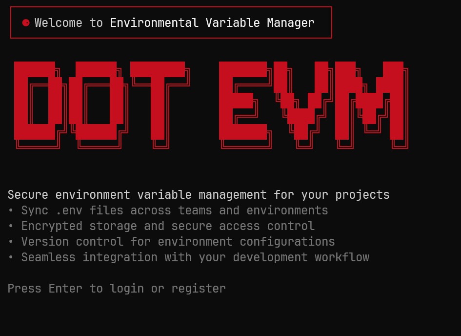

# DOT EVM - Environment Variable Manager



A Git-like CLI tool for managing environment variables across projects with encryption and cloud synchronization.

## ✨ Features

- **Git-like Workflow**: `add`, `push`, `sync`, `revert` commands
- **Multi-file Support**: Automatic detection of `.env*` files
- **AES-256 Encryption**: Secure storage with user-specific salts
- **Project Management**: Organize variables by project
- **Cloud Sync**: PostgreSQL cloud backup with offline support
- **Version Control**: Complete history with rollback capabilities
- **Command Intelligence**: Partial command matching and suggestions
- **Cross-platform**: Works on Windows, macOS, Linux

## 🚀 Quick Start

### Install

```bash
npm install -g .
```

### Setup

```bash
# Initialize user directory
npm run postinstall

# Register/Login
evm register
# or
evm login
```

### Basic Usage

```bash
# Initialize project
evm init

# Stage environment files
evm add

# Commit to local database
evm push

# Sync to cloud (optional)
evm sync

# View status
evm status

# Show history
evm log
```

## 📋 Commands

| Command              | Description               |
| -------------------- | ------------------------- |
| `evm init`           | Initialize new project    |
| `evm add`            | Stage modified .env files |
| `evm push`           | Commit staged files       |
| `evm sync`           | Sync to cloud             |
| `evm status`         | Show file status          |
| `evm log`            | Show commit history       |
| `evm diff`           | Show file differences     |
| `evm revert <hash>`  | Rollback to commit        |
| `evm list`           | List projects/files       |
| `evm rm <project>`   | Remove project            |
| `evm login/register` | User authentication       |

## 🏗️ Architecture

```
~/.evm/                    # User data directory
├── evm.db                # SQLite database
├── config.json           # Configuration
├── session.json          # User session
└── projects/             # Project files

evm-cli/                  # CLI source
├── commands/             # Command modules
├── evm-server/           # Cloud sync server
└── components/           # UI components
```

## 🔧 Configuration

- **Database**: SQLite (local) + PostgreSQL (cloud)
- **Encryption**: AES-256-GCM with user-specific salts
- **Authentication**: JWT tokens
- **Server**: Express.js with REST API

## 📦 Dependencies

- Node.js v14+
- npm/yarn
- PostgreSQL (optional, for cloud sync)

## 🔒 Security

- RSA encryption for passwords
- AES-256-GCM for environment data
- bcrypt password hashing
- User-specific encryption salts

## 📚 More Info

- [Full Documentation](https://github.com/Jayanth1312/DOT-EVM)
- [API Reference](./evm-server/README.md)
- [Contributing Guidelines](./CONTRIBUTING.md)

## 📄 License

MIT License - see [LICENSE](LICENSE) for details.

---

**Built with ❤️ using Node.js, SQLite, PostgreSQL, and Express**
